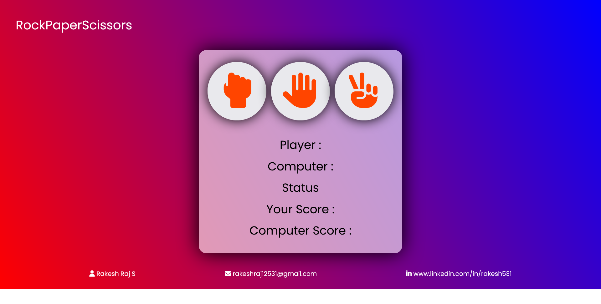

# ✊🖐✌ Rock Paper Scissors Web Game 🎮

A classic game, but make it ✨ digital ✨ — built by your friendly frontend ninja **Rakesh Raj S.**  
This project lets you battle the computer in the ultimate showdown of **rock, paper, scissors** — all coded with raw HTML, CSS & JS skills 💻🔥

---

## 🌄 Sneak Peek – Project Preview 🖼️

*Clean UI. Font Awesome icons. Live score battle. Total dopamine hit!*

---

## 🎥 YouTube Walkthrough – Watch It in Action 🎬

▶️ Full demo video  
🔗 https://youtu.be/W-1B_8ZmJxQ

This ain't just a game — it's war 🥷

---

## 🌐 Live Demo – Challenge the CPU Now 💻

🔗 [Play it Live!](https://rakesh12531.github.io/rockpaperscissor_project/)

💥 Tap, click, dominate. 📱🖥️

---

## 🔥 Game Features That Slap

🎮 Choose between rock, paper, or scissors  
🤖 Computer picks a random move every round  
📊 Scoreboard updates live  
🎨 Font Awesome icons for stylish vibes  
⚡ Lightweight & lightning fast

---

## 🛠️ Tech Stack – Built With Heart ❤️

🧱 HTML – Structure  
🎨 CSS – Styles & layout  
🧠 JavaScript – Logic and interactivity  
🧩 Font Awesome – Icon styling  
🚀 Hosted with GitHub Pages

---

## 👨‍💻 Author – Code Chef Behind This Game

Made with ❤️ by **Rakesh Raj S.**  
A web developer, IoT explorer, and game dev hobbyist 😆

📧 Email: [rakeshraj12531@gmail.com](mailto:rakeshraj12531@gmail.com)  
🔗 LinkedIn: [linkedin.com/in/rakesh531](https://linkedin.com/in/rakesh531)  
🐙 GitHub: [github.com/rakeshraj531](https://github.com/rakeshraj531)

---

## 🚀 What You'll Learn

💡 How to build an interactive game in the browser  
📦 DOM manipulation using JavaScript  
🎯 Event handling and basic logic building  
🎨 Using Font Awesome for UI charm  
🧠 Keeping code clean and readable

---

## 🧪 Pro Tip

Fork it. Clone it. Remix it. Or just flex it on your portfolio.  
And don’t forget to ⭐ this repo if it made you smile, even once 😁

---
